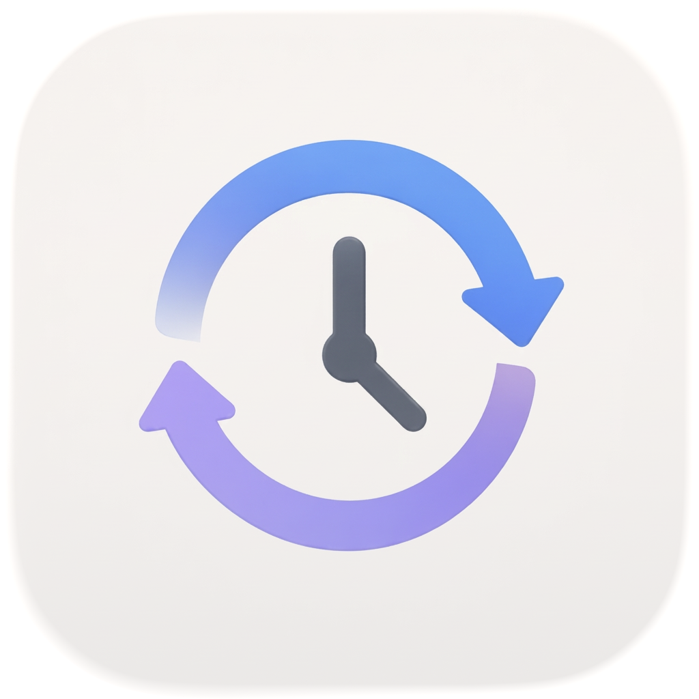
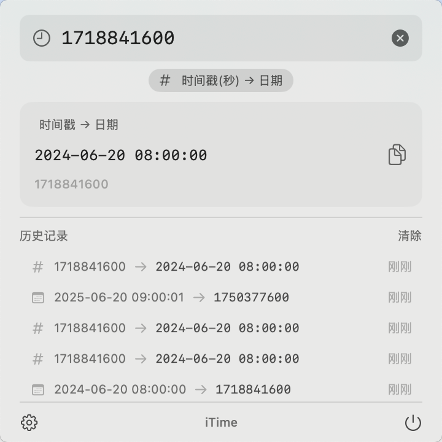
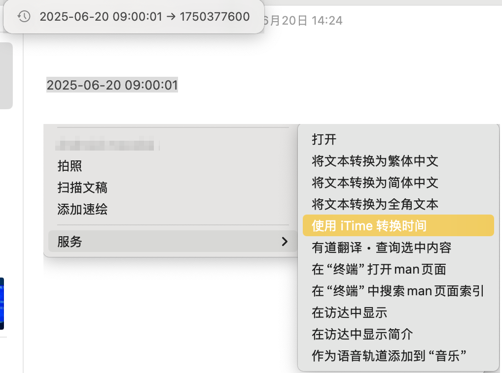
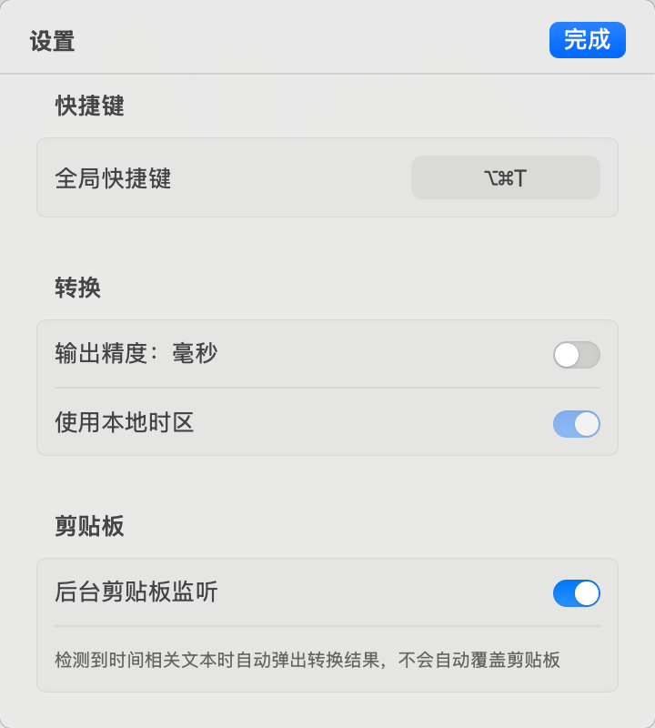

<div align="center">
  

  <h1>iTime</h1>

  <p><strong>macOS 原生菜单栏时间戳互转工具 — 选中即转，2 步搞定。</strong></p>

  <p>
    <a href="https://github.com/mocobk/iTime/releases/latest"></a>
    <a href="LICENSE"></a>
    
    
    <a href="https://github.com/mocobk/iTime/actions"></a>
  </p>
</div>

---

## ✨ 简介

**iTime** 是一款专注于「时间戳 ↔ 可读日期」双向转换的 macOS 菜单栏小工具。

在日志、API 响应、数据库记录中看到 `1718870400` 或 `2026-06-20T16:40:00Z` 时，无需切换浏览器、无需打开 Terminal —— 选中文本，按下 `⌥⌘T`，结果立即出现在 Toast 中并自动写入剪贴板。

> 像系统自带能力一样隐形，做好「一件事」。

## 📸 应用截图

<div align="center">
  <table>
    <tr>
      <td align="center"><strong>菜单栏主界面</strong></td>
      <td align="center"><strong>快捷键转换</strong></td>
      <td align="center"><strong>偏好设置</strong></td>
    </tr>
    <tr>
      <td></td>
      <td></td>
      <td></td>
    </tr>
  </table>
</div>

## 🎯 核心特性

- **🧠 智能识别**：自动判断秒 / 毫秒 / 微秒级时间戳，支持 ISO 8601、中英文日期、紧凑格式等多种输入。
- **⚡️ 全局快捷键**：默认 `⌥⌘T`，优先转换选中文本，自动 fallback 到剪贴板。
- **🖱 Services Menu 集成**：在任何应用中右键 → Services → iTime，原生 macOS 体验。
- **📋 剪贴板自动写入**：转换结果即用，连续触发支持往返转换。
- **🪶 极致轻量**：安装包 < 10 MB，常驻内存 < 30 MB，启动 < 1 秒。
- **🔒 纯本地运行**：零网络、零数据收集、零第三方 SDK。
- **🌗 系统原生外观**：SwiftUI + SF Symbols，深浅模式自动跟随。
- **♿️ 无障碍友好**：完整 VoiceOver 支持，所有交互元素均带 accessibilityLabel。

## 🚀 快速开始

### 下载安装

1. 前往 [Releases 页面](https://github.com/mocobk/iTime/releases/latest)。
2. 下载 `iTime-x.y.z.dmg`。
3. 打开 dmg，将 `iTime.app` 拖入 `Applications` 文件夹。
4. 首次启动时按系统提示授予「辅助功能」与「Services Menu」权限。

> 由于尚未公证（notarize），首次启动若被 Gatekeeper 拦截，可前往「系统设置 → 隐私与安全性」点击「仍要打开」。

### 使用方式

| 操作               | 路径                                                                |
| ------------------ | ------------------------------------------------------------------- |
| **快捷键转换**     | 选中任意文本 → `⌥⌘T` → 结果出现在 Toast 中并已复制                  |
| **右键菜单转换**   | 选中文本 → 右键 → Services → `iTime: 转换时间戳`                    |
| **菜单栏主界面**   | 点击菜单栏 ⏱ 图标，输入或粘贴文本，实时查看转换结果与历史           |
| **偏好设置**       | 菜单栏图标 → ⚙️ 设置，自定义快捷键、输出精度、剪贴板监听、开机自启 |

## 🛠 从源码构建

### 环境要求

- macOS 14.0+ (Sonoma)
- Xcode 15+
- Swift 5.10

### 构建步骤

```bash
# 克隆仓库
git clone https://github.com/mocobk/iTime.git
cd iTime

# 生成 Xcode 工程（脚本生成式）
python3 scripts/generate_xcodeproj.py

# 使用 Xcode 打开
open itime.xcodeproj
```

或使用 Swift Package Manager：

```bash
swift build -c release
```

### 运行测试

```bash
xcodebuild test -project itime.xcodeproj -scheme itime -destination 'platform=macOS'
```

## 🏗 项目结构

```
itime/
├── App/            # SwiftUI 入口、AppDelegate
├── Models/         # 数据模型（ConversionResult / HotkeyConfig 等）
├── Engine/         # 转换引擎（DateParser / TimestampDetector / OutputFormatter）
├── Services/       # 系统集成（剪贴板、快捷键、Services Menu、Toast）
├── UI/             # SwiftUI 视图（Popover、Settings、Toast、History）
├── Utilities/      # 辅助工具
└── Resources/      # Assets、Info.plist、Entitlements
```

## 🗺 路线图

- [x] Phase 1 — 时间戳双向转换、全局快捷键、Services Menu、菜单栏 Popover
- [ ] Phase 2 — 历史记录持久化与搜索
- [ ] Phase 2 — 批量转换（多行文本一次性识别）
- [ ] Phase 2 — 自定义输出格式模板
- [ ] Phase 3 — Mac App Store 上架

## 🤝 贡献

欢迎 Issue / PR！在提交 PR 前请确保：

1. 通过现有测试 (`xcodebuild test ...`)。
2. 遵循 [Apple HIG](https://developer.apple.com/design/human-interface-guidelines)。
3. 不引入第三方 SDK 或网络请求。

## 📄 License

[MIT License](LICENSE) © 2026 mocobk
